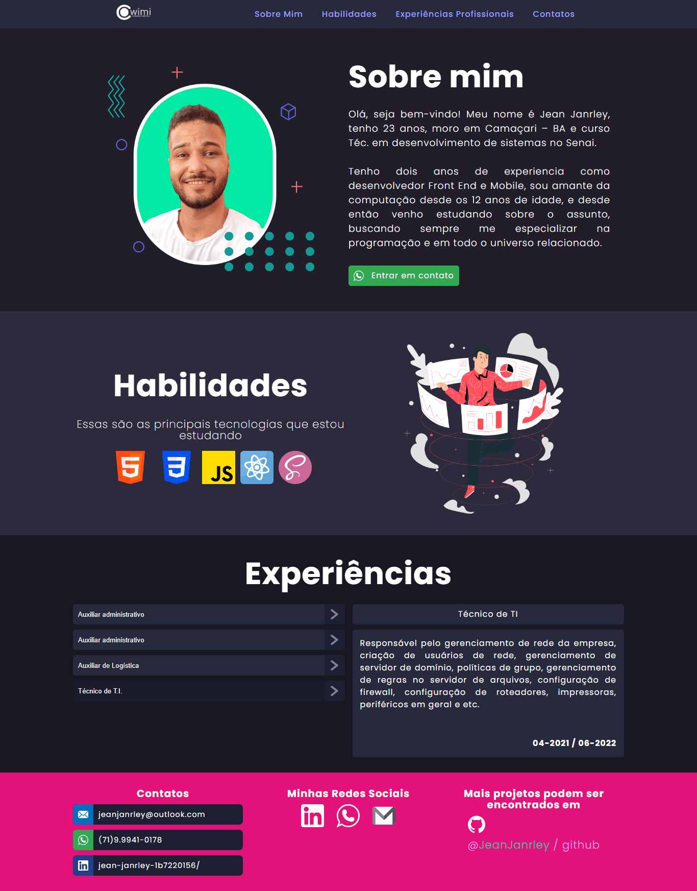

<h1> 🚀 Seja bem vindo ao meu portfólio pessoal!</h1>

Este projeto foi construído com HTML 5, CSS 3 e Javascript

<h2>🔴 Neste projeto priorizei algumas coisas:</h2>
<ol>
	<li>Responsividade.</li>
	<li>Otimizar o carregamento da página reduzindo </li>o peso das imagens.
	<li>Seguir as boas práticas de SEO.</li>
	<li>Seguir as boas práticas de acessibilidade</li>
</ol>

<strong>
(OBS) Para sugestões ou caso encontre algum erro, comportamento indevido e etc, sita-se a vontade para me reportar em qualquer um dos meios de comunição que se encontram na página.
</strong>  

<h2>
	Sinta-se à vontade para visitar a pagina publicada no link abaixo.
</h2>

🚩 Página: <a href="https://jeanjanrley.github.io/portfolio/">https://jeanjanrley.github.io/portfolio/</a>

<h1>Screenshots</h1>
